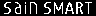

# ironos-flasher

shell script for flashing the open source soldering iron firmware (ironos) to compatible devices

## logos

| images                                                   | file                                                   | comment                            |
| :------------------------------------------------------- | :----------------------------------------------------- | :--------------------------------- |
|                                                          | [\_clear.hex](logos/_clear.hex)                        | to remove the logo from the device |
|                            | [atari.hex](logos/atari.hex)                           |                                    |
|  | [back_to_the_future.hex](logos/back_to_the_future.hex) |                                    |
|              | [breaking_bad.hex](logos/breaking_bad.hex)             |                                    |
|                    | [commodore.hex](logos/commodore.hex)                   |                                    |
|              | [do_not_touch.hex](logos/do_not_touch.hex)             |                                    |
|                          | [github.hex](logos/github.hex)                         | mrdotx github url                  |
|                      | [miniware.hex](logos/miniware.hex)                     |                                    |
|                      | [nintendo.hex](logos/nintendo.hex)                     |                                    |
|                | [open_source.hex](logos/open_source.hex.hex)           |                                    |
|                          | [pacman.hex](logos/pacman.hex)                         |                                    |
|                    | [sainsmart.hex](logos/sainsmart.hex)                   |                                    |
|                          | [sequre.hex](logos/sequre.hex)                         |                                    |
|          | [space_invaders.hex](logos/space_invaders.hex)         |                                    |
